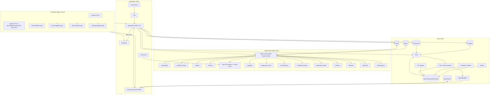
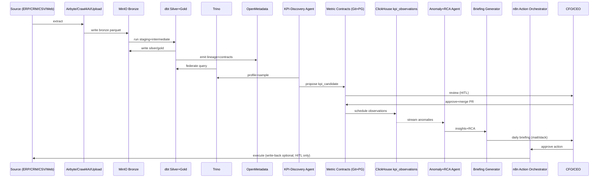
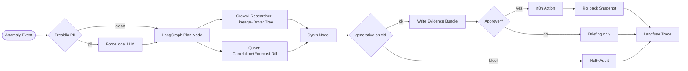
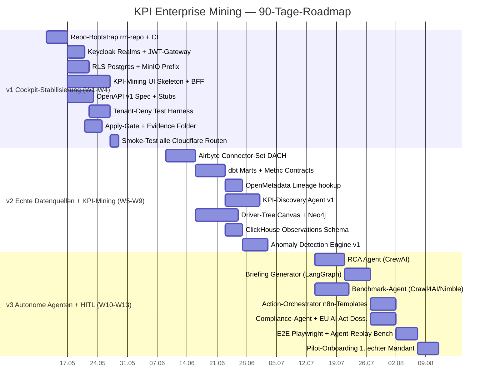

# KPI Enterprise Mining – Architektur- und Anforderungsdokumentation v2

**Plattform:** ben-e-fit / medialine / ki-guru
**Laufzeitumgebung:** NVIDIA DGX Spark (On-Prem, EU)
**Stand:** 2026-05-09 (kanonisch übernommen 2026-05-10)
**Quelle:** Architektur-Board (rm-repo / ben-e-fit Org) — User-Input
**Status:** v2 – freigabefähig für Sprint-Planung
**Klassifizierung:** intern / Engineering- und C-Level

> Dieses Dokument ist die **kanonische Referenz** für KPI Enterprise Mining.
> Alle Skills (`kpi-mining-ops`, `-product`, `-metric-contracts`, `-agent-runtime`,
> `-market-intel`, `-tenant-onboarding`, `-evals`) und alle Sprint-Planungen
> beziehen sich auf diese Datei.
>
> Hinweis: Der Roh-Input wurde am Übergabepunkt nach Teil 7 (Quellen/Referenzen)
> abgeschnitten. Fehlende Referenzeinträge werden bei Bedarf in
> `market-intel/COMPETITIVE-ANALYSIS.md` ergänzt.

---

## 0. Executive Summary

Der KPI-/Decision-Intelligence-Markt hat sich zwischen 2024 und 2026 grundlegend gewandelt: Aus klassischer BI ist „**Agentic Analytics**" geworden. Anbieter wie ThoughtSpot (Spotter / SpotterModel / SpotterViz), Tableau Pulse, Qlik (Discovery Agent + Qlik Answers + MCP Server), Microsoft Fabric Copilot, Cube D3, Pigment und ValueWorks.ai setzen heute alle auf eine Kombination aus **Semantic Layer + Driver Trees + LLM-Agenten + Anomalie-Detection + proaktiven Insight-Feeds**. Diese Bausteine sind 2026 *Tabellenstakes* – kein Differenzierer mehr.

Differenzieren werden sich Anbieter in 2026/2027 entlang folgender vier Achsen:

1. **Souveränität & On-Prem.** Mit dem In-Kraft-Treten der Hochrisiko-Pflichten des EU AI Act zum **2. August 2026** (Artikel 9–17, 26, 27) und der parallelen Diskussion um die Verschiebung via „Digital Omnibus" auf Dezember 2027 entsteht ein massiver Bedarf an europäisch-souveränen, audit-fähigen, deployer-freundlichen Plattformen. SaaS-Hyperscaler-Stacks (Tableau+Salesforce/Einstein, Fabric+OpenAI in US/EU-Regionen, ThoughtSpot Spotter mit GPT/Gemini/Cortex) sind hier strukturell im Nachteil.
2. **Mandantenfähigkeit auf Daten-, Index- und Agent-Ebene** – nicht nur „Workspaces", sondern echte Tenant-Isolation inklusive negativer Deny-Tests als Release-Gate.
3. **Hybrid-LLM-Routing** mit harten Policy-Gates (PII-Filter, Souveränitäts-Klasse) zwischen lokalen Modellen (Qwen3, Llama3 via Ollama+LiteLLM) und Cloud-Modellen (OpenRouter / Claude / GPT-Klasse) für unkritische Aufgaben.
4. **Audit-Trail & SelfCLAW-Governance**: jeder Agent-Lauf reproduzierbar, jeder „Apply" mit Evidence + Approval + Rollback, durchgängig per Tenant separiert.

**KPI Enterprise Mining** (kpi-mining) ist das Produkt, das genau in dieser Lücke positioniert wird. Es nutzt die bereits existierende DGX-Plattform (Trino, OpenMetadata, Neo4j, OpenSearch+Qdrant, Langfuse, LiteLLM, Keycloak, n8n, AutoGen Studio, CrewAI, Flowise, Docling, Presidio, generative-shield, Letta, AnythingLLM, Whisper, SearXNG, MinIO, ClickHouse, Postgres, Crawl4AI, Nimble, Documenso, Grafana/Loki/Tempo, Uptime Kuma) und liefert auf dieser Basis die fünf Kern-Werte:

- **KPI-Discovery & Metric Contracts** – das System findet KPIs in angebundenen Quellen selbständig und versioniert sie als Verträge.
- **Driver-Tree & OKR-Lineage** – KPIs werden in Wirkungsbäume und OKR-Maßnahmen verankert (Neo4j).
- **C-Level-Briefing-Agent + Benchmark-Agent** – tägliche/wöchentliche/monatliche „Was-ist-los / Was-tun"-Briefings inkl. externer Benchmarks.
- **Action-Orchestrator mit HITL** – Maßnahmen werden nicht autonom ausgeführt, sondern als Vorschlag in n8n/Slack/Teams/E-Mail/Documenso übergeben (SelfCLAW: no auto-apply, evidence, approval, rollback).
- **Compliance-/Audit-Agent** – EU AI Act Art. 26+27, ISO 27001, GDPR-Lineage out-of-the-box.

Die 90-Tage-Roadmap gliedert sich in **v1 Cockpit-Stabilisierung** (Wochen 1–4), **v2 Echte Datenquellen + KPI-Mining** (Wochen 5–9) und **v3 Autonome Agenten + HITL** (Wochen 10–13). Geschätzter Gesamtaufwand: **48–62 FTE-Wochen** über vier Squads.

Der Rest dieses Dokuments ist die kanonische Referenz für die Sprint-Planung im **rm-repo** und bindend für alle KPI-Skills (kpi-mining-ops, -product, -metric-contracts, -agent-runtime, -market-intel, -tenant-onboarding, -evals).

---

# TEIL 1 – Marktanalyse & Wettbewerbslage 2026

## 1.1 Methodik & Quellenqualität

Die folgende Analyse fußt auf öffentlich zugänglichen Produkt- und Pricing-Seiten der Wettbewerber, Analyst-Reports (Gartner Magic Quadrant Metadata Management 2025, Gartner Market Guide for Agentic Analytics 2026, Forrester Wave Data Governance Q3 2025, GigaOm Radar Semantic Layers 2025) sowie technischer Reviews bei TechTarget, G2, Vendr, Embeddable, Sparvi, Sifflet und Coalesce. Wo Quellen Marketing-Sprache verwenden („AI-native", „zero hallucination") wurde dies als Anbieter-Claim gekennzeichnet, nicht als verifizierter Fakt. Pricing-Angaben sind Listenpreise oder bei Vendr/G2 dokumentierte Verhandlungs-Benchmarks; reale Deals weichen typischerweise 20–40 % nach unten ab.

## 1.2 Wettbewerber-Landscape

### Cluster A – Strategische CFO/CEO-Plattformen (direktester Vergleich zu KPI Enterprise Mining)

**ValueWorks.ai (Karlsruhe, DE)** – „Intelligent Operating System for Executives". Stärkstes Vergleichsobjekt im DACH-Mittelstand. Funktionsumfang: KPI-Tree (P&L „Cost-of-Sale"-Methodik), Liquiditätsplanung, Investor-Reporting mit 100+ vordefinierten Branchen-KPIs, OKR-Modul mit AI-Empfehlungen, Co-Pilot mit AI, statistisches und KI-basiertes Forecasting (inkl. Churn-Forecasting), Plug-&-Play-Konnektoren zu ERP/CRM/HR. Zielgruppe: schnellwachsende Mittelstands-/PE-Portfolio-Unternehmen, CFOs, Investoren. Pricing: nicht öffentlich, typisch im Bereich 25–100 k€/Jahr je Mandant. **Schwächen:** kein echter mandantenfähiger On-Prem-Modus, keine ausgewiesene EU-AI-Act-Konformitäts-Story, keine offene Agent-Architektur, geschlossenes Ökosystem (kein dbt/OpenMetadata/Neo4j-Anschluss), Sprache primär EN, Self-Service-Analytics relativ statisch.

**Drivetrain, Mosaic, Abacum** – modernes FP&A, ähnliche Spielwiese, aber stark SaaS-lastig.

### Cluster B – Agentic BI / Augmented Analytics (Incumbents)

**ThoughtSpot Spotter / SpotterModel / SpotterViz / Spotter 3 / SpotterCode (+ MCP Server).** Spotter 3 (2025) blendet strukturierte und unstrukturierte Daten, kann Python und Forecasting; SpotterModel automatisiert das Semantic-Modeling mit Human-in-the-Loop-Validation. **Pricing:** Essentials 25 USD/User/Monat, Pro 50 USD/User/Monat oder ~0,10 USD/Query (25–1.000 User, 250 Mio Rows), Enterprise custom (laut G2 ab ca. 12.000 USD/Monat, große Deals > 500 k USD/Jahr). LLM-Anbindung über GPT/Gemini/Cortex/Claude. **Schwächen:** Pro-Plan unterstützt kein echtes Multi-Tenant; AI-Features lt. unabhängigen Reviews „half-baked" bei komplexen Fragen; pricing-intransparent; keine On-Prem-Souveränität.

**Tableau Pulse + Tableau Agent + Agentforce.** Pulse ist in jeder Tableau-Cloud-Edition enthalten, Enhanced Q&A nur in Tableau+ (premium). Insight-Feeds, Driver-Erklärungen, Slack/Email-Digests. AI läuft über Einstein/Agentforce Trust Layer mit geo-aware LLM-Routing über Azure OpenAI. **Pricing:** Tableau Creator ~75 USD/User/Monat, Explorer ~42 USD, Viewer ~15 USD; Agentforce konsumiert seit Okt 2025 keine Einstein-Request-Credits mehr. **Schwächen:** harte Salesforce-Bias, kein echter On-Prem-Modus, Tableau+-Premium-AI nur bei verbundener Salesforce-Org, keine offene Agent-API.

**Qlik Discovery Agent + Qlik Answers + Qlik MCP Server.** Discovery Agent (GA seit 2025) monitort Qlik-Apps proaktiv auf statistisch signifikante Anomalien und liefert priorisierte Insight-Feeds. Qlik Answers vereint strukturiert + unstrukturiert in einem konversationellen Layer und kann automations-basierte Aktionen anstoßen. Datengrundlage durch Qlik Talend Cloud + AI Trust Score (Juli 2025) + Open Lakehouse mit Apache Iceberg. **Schwächen:** Vendor-Lock auf Qlik-Apps; Discovery Agent ist nur EN; keine fine-grained access control für Discovery Agent (lt. Qlik Help); klassische SaaS-Architektur.

**Microsoft Fabric + Copilot.** Seit April 2025 ist Copilot ab Capacity F2 verfügbar (vorher F64), Abrechnung über Capacity Units (400 CU-sec / 1.000 Input-Token, 1.200 CU-sec / 1.000 Output-Token). Fabric Copilot Capacity (FCC) erlaubt dezidierte Verrechnung. Fabric Data Agents adressieren Natural-Language-Anfragen auf Lakehouse-Daten. **Schwächen:** Datenresidenz nur EU/US-Boundary, alles Azure-nativ, kein DGX/On-Prem-Pfad; Power-BI-Pro-Lizenzen weiterhin nötig unter F64.

### Cluster C – Connected Planning / FP&A

**Anaplan (Hyperblock + Polaris).** Multidimensional, sehr enterprise-heavy, 18-Monats-Implementierungen üblich. Pricing typisch 50 k–500 k USD/Jahr. **Pigment** – AI-native EPM, 2024–2026 schnell wachsend; AI-Agents für „Mini-CFO"-Use-Cases; bei Vendr 20–40 % günstiger als Anaplan im Mid-Market. **Workday Adaptive Planning** – ab 50 k USD/Jahr, sinnvoll nur bei Workday-HCM-/Financial-Stack. Alle drei sind Closed-Source-SaaS und können DGX/On-Prem nicht abdecken.

### Cluster D – Semantic Layer / Headless BI

**Cube (Cube Cloud + Cube D3).** GigaOm-Leader 2025, Gartner-Market-Guide for Agentic Analytics 2026. Cube Core OS (18k+ GitHub Stars), REST/GraphQL/SQL/MDX/DAX-APIs, AI-API für LLM-Routing zur Semantic-Layer-Query, Pre-Aggregations, Pivot, Multi-Tenant-Konfiguration. Cube wird zur infrastrukturellen Basis vieler Agentic-BI-Stacks. Gartner: „60 % der Agentic-Analytics-Projekte, die nur auf MCP setzen, werden bis 2028 wegen fehlendem Semantic Layer scheitern" (Gartner-Prognose, Januar 2026 – Status: Vorhersage, nicht beobachteter Fakt).

**AtScale, GoodData, dbt Semantic Layer (MetricFlow), Snowflake Semantic Views (GA Nov 2025), Databricks Metric Views.** Universalsemantic vs. plattform-nativ.

**Konsequenz für KPI Enterprise Mining:** Wir bauen **keinen** eigenen Semantic Layer. Wir nutzen **dbt + dbt Data Contracts + Trino + OpenMetadata** als „logischen" Semantic Layer, mit der Option, später Cube Core (OSS) als zusätzlichen Aggregations-/AI-API-Layer einzuziehen, falls Performance- oder NL-Bedarf das erfordert.

### Cluster E – Data Catalogs / Lineage / Governance

**Atlan** – Gartner MQ Leader 2025 (Metadata) und 2026 (D&A Governance), Forrester Wave Leader 2024+2025; positioniert sich als „Context Layer for AI" mit MCP-Server. SaaS-first, Custom-Pricing.

**Collibra** – Enterprise-Governance-Schwergewicht; QueryFlow-Lineage; 3–9 Monate Deployment.

**OpenMetadata / Collate** – Open Source, von den Gründern von Apache Atlas / Hadoop / Uber Databook; Apache-Iceberg-basiertes Metadata-Lakehouse; column-level Lineage; SDKs für Python/Java; GA-grade. **Hier liegt unser strategischer Vorteil: OpenMetadata läuft bereits auf catalog.medialine.app und meta.medialine.app.**

### Cluster F – Data Observability

**Monte Carlo** – Pionier, ML-Anomaly-Detection, Field-Level-Lineage, Custom-Pricing (typisch 100k+ USD/Jahr enterprise). **Datafold** – Data-Diff vor Deployment, dbt-native, im CI/CD. **Metaplane** – April 2025 von Datadog akquiriert, „Datadog for Data". Beide adressieren Data-Quality-Drift, das KPI Enterprise Mining ergänzend braucht.

### Cluster G – Moderne AI-Native Datawork-Tools

**MotherDuck** – managed DuckDB, Hybrid-Cloud-Abfragen; **Dust** – AI-Agent-Workspace; **Glean Work AI** – Enterprise-RAG-Search. Diese sind eher Komplementär-Werkzeuge als direkte Wettbewerber.

### Cluster H – Agentic-BI-Startups

**Athenic AI** (San Francisco, 4,3 Mio USD Seed Jan 2025, BMW i Ventures lead) – Knowledge-Graph + LLM, „instant data answers". **Quaeris** – konversationelle BI / Enterprise Search (2,75 Mio USD). **Hyperbound, Delphi AI, Praxis AI, WisdomAI, Zenlytic, Seek AI, Domyn, Fluent (formerly Channel)** – allesamt Frühphasen-Vendoren mit 5–25 Mio USD Funding, schmaler Funktionsumfang, kein On-Prem.

## 1.3 Feature-Matrix Tabellenstakes vs. Differenzierer 2026

| Feature | Tabellenstakes (jeder hat es) | Differenzierer (selten) | KPI Enterprise Mining v2 |
| --- | --- | --- | --- |
| KPI-Catalog / Metric Library | Ja (alle) | – | + 100+ Templates aus Skills |
| Driver-Tree / Wirkungsbaum | ValueWorks, Tableau Pulse, Pigment | – | Neo4j-basiert, manuell + agent |
| NL-to-SQL / Q&A | alle | – | via LiteLLM + Trino |
| Anomaly Detection | Qlik, Tableau Pulse, ThoughtSpot, Monte Carlo | – | Discovery-Agent-äquivalent |
| Semantic Layer | Cube, dbt, Snowflake, Databricks | – | dbt + Contracts + Trino |
| Audit-Trail Agent-Runs | – | Differenzierer | Langfuse + ClickHouse |
| EU AI Act Art. 26/27 ready | – | starker Differenzierer | Compliance-Agent |
| Souveränität / On-Prem first | nur Qlik teilweise, OnPremise-Q3-2025 | Killer-Differenzierer | DGX Spark |
| Mandantenfähig (Daten+Agent+Index) | nur ThoughtSpot Enterprise | Differenzierer | Keycloak Realms + RLS + Qdrant-Collections |
| Hybrid-LLM (lokal + cloud, Policy) | – | Differenzierer | LiteLLM + Presidio + generative-shield |
| HITL Action-Orchestrator | nur Pigment Agents teilweise | Differenzierer | n8n + Documenso |
| Open-Source Stack | – | Differenzierer | dbt, Trino, OpenMetadata, Neo4j, etc. |
| Proaktiver Insight-Feed | Qlik Discovery, Tableau Pulse, ThoughtSpot Spotter | – | Briefing-Generator |

## 1.4 Marktlücke und Positionierung

Die Marktlücke ist eindeutig identifizierbar:

> **„On-prem-souveränes, mandantenfähiges Agentic-KPI-System mit DGX-GPU-Power, EU-AI-Act-audit-ready, mit offenem dbt/Trino/OpenMetadata/Neo4j-Stack, das CFO-/CEO-/COO-Briefings, Driver-Trees, Maßnahmen-Workflows und externe Benchmarks in einem System liefert – ohne dass Daten den Mandanten-Perimeter verlassen."**

Diese Position ist von Tableau, ThoughtSpot, Qlik, Microsoft Fabric, Pigment, Anaplan, ValueWorks **strukturell nicht erreichbar**, weil sie an Salesforce/Azure/AWS/Google-Stacks gekoppelt sind. Atlan, Collibra, OpenMetadata sind reine Catalog-Layer, kein KPI-Mining-Produkt. Die Agentic-BI-Startups (Athenic, Quaeris) haben weder Mandantenfähigkeit noch DGX-/On-Prem-Story.

## 1.5 Total Addressable Market (TAM) und Käuferprofile

**Geo-Fokus:** DACH + EU, sekundär CH/AT/UK. **Vertikalen:** regulierte Branchen (Finanzdienstleister, Gesundheit/MedTech, kritische Infrastruktur, öffentliche Hand, Versicherungen, PE-Portfolios). **Buyer Personas:**

- **CFO Mittelstand (50–500 Mio € Umsatz):** sucht Investor-Reporting, Liquiditätsplanung, KPI-Dashboards. Pain: Excel-Wildwuchs, kein einheitliches KPI-Dictionary.
- **CEO/COO Holding/PE-Portfolio:** braucht konsolidierte Sicht über 5–30 Beteiligungen, Benchmark gegen Markt, „Was tun?".
- **Group Controller / FP&A Lead:** baut Driver-Trees, will dbt-/Git-Workflow, ohne Anaplan-Komplexität.
- **CIO/CISO regulierter Branche:** Souveränität non-negotiable, EU AI Act, ISO 27001, GDPR-Lineage.
- **Berater/Implementation-Partner (medialine + ki-guru selbst):** wollen Multi-Tenant-Plattform für Kunden-Onboarding ohne pro-Kunde-Deploy.

**TAM-Schätzung (top-down).** EU-Markt FP&A + augmented BI 2026 ~14–16 Mrd USD (Gartner/IDC-Mischschätzung). Souveräner On-Prem-Anteil <5 % heute, prognostiziert 12–18 % bis 2028 wegen EU-AI-Act → **adressierbares Sub-TAM 700 Mio – 2,5 Mrd USD**. SAM (DACH-regulierter Mittelstand + PE) ~120–250 Mio USD. SOM v1 (3 Jahre) bei realistischer 1–2 %-Penetration: **8–25 Mio €/Jahr ARR-Potenzial**.

## 1.6 Pricing-Benchmark

| Modell | Beispiel | Range |
| --- | --- | --- |
| Per Seat (Creator/Explorer/Viewer) | Tableau, ThoughtSpot Essentials | 15–75 USD/User/Monat |
| Per Capacity (CU/SKU) | Microsoft Fabric F2–F128 | ~280 €/Mon (F2) bis 18 k €/Mon (F64) |
| Per Query / Usage | ThoughtSpot Pro 0,10 USD/Query | nutzungsabhängig |
| Per Tenant Platform Fee | Pigment, Anaplan | 50 k–500 k USD/Jahr |
| Per Mandant Mid-Market DACH | ValueWorks (geschätzt) | 25–100 k €/Jahr |
| Pro Driver Tree / Pro KPI | – | (selten) |

**Empfehlung KPI Enterprise Mining v2 Pricing (Vorschlag, nicht final):**
- **Plattform-Lizenz pro Mandant:** 18–60 k €/Jahr (Tier S/M/L) – inkludiert N Connector-Slots, M Briefings/Monat, K Driver Trees.
- **Per Seat Add-on** für Self-Service: 25–75 €/User/Monat ab Seat 11.
- **DGX-Compute-Pauschale** pro Mandant (Fair-Use Tokens) mit Burst-Verrechnung über cost-proxy.
- **Compliance-Pack** (EU AI Act Audit-Bundle): +6 k €/Jahr.

---

# TEIL 2 – Anforderungs-Spezifikation v2

## 2.1 Funktionale Anforderungen (FR)

### FR-01 KPI-Discovery Agent
**Beschreibung.** Aus angebundenen Datenquellen (Airbyte-synchronisierte ERP/CRM/Buchhaltungs-Tabellen, Excel/CSV-Uploads, REST-APIs, Crawl4AI-Webcrawls) erkennt der Agent Kandidaten-KPIs heuristisch und LLM-gestützt (Spalten-Statistik + Schema + dbt-Modell + OpenMetadata-Tags + Letta-Memory). Ergebnis: persistierte `kpi_candidates` mit Score, Begründung, Quelle, Vorschlags-SQL/Trino-Statement.
**Akzeptanz.** Bei einem frischen Mandanten mit 1 ERP + 1 CRM (Postgres/MySQL) müssen innerhalb 30 Min. ≥ 25 Kandidaten-KPIs identifiziert sein, ≥ 60 % mit menschlicher Review als „valide" akzeptiert.

### FR-02 Metric Definition Store / Metric Contracts
**Beschreibung.** Jeder finalisierte KPI ist ein versioniertes Artefakt mit semantischer Definition, Owner, Owner-Domain, Berechnungs-SQL/dbt-Modell, Granularität, Einheit, „direction = up/down is favorable", Zielwert, Toleranzband, Refresh-Cadence, Datenklassifikation (PII/intern/public), Compliance-Tags. Format: YAML in `contracts/metric-contracts/<tenant>/<kpi>.yaml`, gespiegelt nach Postgres-Tabelle `metric_definitions`. Versionierung über Git + dbt Data Contracts. Jede Änderung ist ein PR; Rollback durch `git revert` + Apply-Gate.
**Akzeptanz.** Schema-validiert via JSON-Schema; CI lehnt Contracts mit fehlenden Pflichtfeldern ab; jede `kpi_observations`-Zeile referenziert exakt eine Contract-Version.

### FR-03 Driver-Tree Builder
**Canvas-UI** mit Drag-and-Drop (kpi-mining Frontend, served via kpi.ben-e-fit.ai). Knoten = KPIs, Kanten = Wirkungsbeziehungen mit Gewicht und Confidence. Manueller Modus + Agent-Modus (LangGraph-Workflow, der aus Korrelationen + LLM-Domain-Wissen Vorschläge macht). Persistenz in **Neo4j** (graph.medialine.app) mit Tenant-Property auf jedem Node/Edge.
**Akzeptanz.** Ein Driver-Tree mit ≥ 30 Knoten lädt < 1,5 s; Agent generiert Vorschläge mit Erklärungs-Trace in Langfuse.

### FR-04 OKR-Lineage
Verknüpfung KPI ↔ OKR-Objective ↔ Key-Result ↔ Maßnahme. Modell in Postgres + Spiegelung in Neo4j. Jede Maßnahme verweist auf einen Action-Run im Action-Orchestrator.

### FR-05 Forecasting & Monte-Carlo-Simulation
Mehrere Modellklassen: ARIMA/Prophet (statistisch), Gradient Boosted Trees (driver-basiert), Quantil-Regression für Konfidenz-Bänder, Monte-Carlo-Sampling (10 k–100 k Pfade) für Liquiditäts-/Umsatz-Szenarien. Trainings-Pipelines via dbt + Python-Worker im agents-orchestrator-Container, Modell-Registry in MinIO `gold/models/<tenant>/`. GPU-Acceleration auf DGX für GBT/Deep-Learning-Modelle.

### FR-06 Anomaly Detection + RCA Agent
Algorithmen: STL-Decomposition, Robust Z-Score, Prophet-Residuals, Isolation Forest. Pro Metric Contract konfigurierbar. RCA-Agent (CrewAI mit Researcher + Quant + Reporter) untersucht Anomalien anhand Driver-Tree (Neo4j-Traversal), Lineage (OpenMetadata), Korrelations-Suche und liefert Root-Cause-Hypothese mit Evidence-Snippets.

### FR-07 C-Level Briefing Generator
Daily/Weekly/Monthly. Generiert einen Briefing-Report (Markdown + PDF via Docling-Reverse) mit:
1. „Was ist passiert" (Anomalien, Top-Mover),
2. „Warum" (RCA + Driver-Tree-Pfade),
3. „Was tun" (3–5 Maßnahmenvorschläge mit erwartetem Impact),
4. „Benchmark" (interner Trend + externer Marktvergleich aus Benchmark-Agent).
Ausgabe per E-Mail (n8n), Slack/Teams, signierbar via Documenso.

### FR-08 Benchmark-Agent
Externe Quellen: Crawl4AI-Crawls (öffentlich), Nimble (strukturierte SaaS-Aggregation), API-Provider (Statista, Eurostat, Bundesbank, ECB, ERP-Branchen-Reports). Skill `kpi-market-intel` definiert Crawl-Pläne. Resultate landen in `benchmarks` (ClickHouse) mit Lizenz-Metadaten. Vor jedem externen Call: Policy-Gate (Souveränitäts-Klasse, Lizenz-Check).

### FR-09 Action-Orchestrator (HITL)
Workflows in n8n (n8n.medialine.app). Maßnahmen-Templates (z. B. „Mahnlauf anstoßen", „Pricing-Review einberufen", „Lieferanten-Eskalation", „Marketing-Budget umschichten") mit Parametern. Jede Aktion durchläuft Apply-Gate: (1) Vorschlag generiert, (2) Evidence-Bundle, (3) Approver-Liste (Keycloak-Rolle), (4) Approve/Reject mit Begründung, (5) Ausführung, (6) Rollback-Snapshot, (7) Audit-Log. Niemals auto-apply.

### FR-10 Compliance / Audit Agent
Mappt jeden Agent-Run und jede Maßnahme auf:
- **EU AI Act Art. 26** (Deployer-Pflichten: Anweisungen befolgen, menschliche Aufsicht, Eingangsdaten relevant, Monitoring, Incident Reporting),
- **Art. 27** (FRIA-Pflicht für Kreditwürdigkeit/Versicherung/öffentlichen Sektor),
- **ISO 27001 Annex A** (Zugriffs-Kontrolle, Logging, Lieferantenmgmt.),
- **GDPR Art. 30** (Verzeichnis von Verarbeitungstätigkeiten) + **Art. 35** (DPIA).
Output: Compliance-Dossier pro Mandant je Quartal.

### FR-11 Multi-Source Connectors
- **Airbyte**: ERP (SAP B1, NetSuite, MS Dynamics, DATEV, Sage, Lexware), CRM (HubSpot, Salesforce, Pipedrive), Buchhaltung, Marketing (GA4, Meta Ads, LinkedIn).
- **File-Upload**: Excel/CSV via kpi-mining UI → MinIO Bronze → Trino External.
- **REST**: generischer Connector mit OpenAPI-Import.
- **Crawl4AI/Nimble**: für externe Marktdaten.

### FR-12 Mandantenfähiges Onboarding/Self-Service
Wizard im kpi-mining UI: (1) Tenant anlegen → Keycloak Realm + Postgres-Schema + MinIO-Prefix + Qdrant-Collection + LiteLLM-Virtual-Key, (2) Branding/Logo, (3) Connector-Setup, (4) Initial KPI-Discovery, (5) Approver-Rollen. Time-to-First-Briefing ≤ 4 h.

### FR-13 Hybrid LLM-Routing
LiteLLM (llm.medialine.app) routet basierend auf:
- **Datenklassifikation** (PII/streng vertraulich → nur lokal Qwen3/Llama3 via Ollama),
- **Aufgabentyp** (Reasoning-heavy bei nicht-sensiblem Public-Content → OpenRouter-Modelle erlaubt),
- **Quota** (Virtual Key pro Tenant),
- **Latenz-Budget**.
Vorgeschaltet: Presidio Analyzer (PII-Scan), generative-shield (Prompt-Injection/Toxicity). Bei PII-Hit + Cloud-Modell: Block + Fallback lokal.

## 2.2 Nicht-funktionale Anforderungen (NFR)

### NFR-01 Tenant-Isolation (Daten / Index / Agent)
- **Postgres**: Schema pro Tenant + Row-Level-Security-Policy auf jeder shared Tabelle (`tenant_id = current_setting('app.tenant')`).
- **Trino**: Catalog/Schema-Mapping pro Tenant, optionaler Trino-Access-Control-Plugin.
- **MinIO**: `s3://lake/<tenant>/{bronze,silver,gold}/...`, IAM-Policy bindet bucket-prefix an Service-Account.
- **ClickHouse**: Database pro Tenant, RBAC.
- **Qdrant**: Collection pro Tenant.
- **OpenSearch**: Index-Pattern `kpi-<tenant>-*` mit Document-Level-Security.
- **Neo4j**: Database-per-Tenant (Enterprise) **oder** Tenant-Property + label-based RBAC mit Custom Procedures (Community).
- **Agent-Runtime**: jeder LangGraph/CrewAI/Flowise/AutoGen-Run injiziert `tenant_id` in den State; LiteLLM-Virtual-Key trägt `tenant_id` als Tag.
- **Release-Gate (negativ-deny-Test)**: CI führt automatisierte Cross-Tenant-Zugriffstests aus; Tenant A versucht, Daten von Tenant B zu lesen, erwartet **403/empty**. Schlägt der Test fehl, wird der Release blockiert.

### NFR-02 Audit-Trail
**Langfuse** (trace.medialine.app) erfasst jede LLM-Interaktion (Input, Output, Modell, Cost, Latenz, Tenant-Tag). Zusätzlich schreibt der agents-orchestrator pro Agent-Run einen Trace nach **ClickHouse** `agent_runs_<tenant>` mit Tool-Calls, Tool-Args, Evidence-URIs, Approval-Status, Outcome. Aufbewahrung 7 Jahre (HGB §257) für regulierte Tenants konfigurierbar.

### NFR-03 Data Sovereignty / On-Prem-First
Default: kein ausgehender Datenverkehr. Externer LLM-/API-Aufruf nur über Policy-gateway mit explizitem `external = true`-Flag im Metric Contract bzw. Skill-Manifest. DGX Spark als primäre Compute-Plane.

### NFR-04 Performance-SLOs
- Cockpit-Initialladezeit < 2 s P95.
- Driver-Tree mit 30 Knoten < 1,5 s P95.
- Briefing-Generierung (M-Tier Tenant) < 90 s P95.
- Async Agent-Run Replay verfügbar < 10 s nach Run-Abschluss.
- Trino-Query auf Gold-Layer ≤ 5 s P95 für Standard-KPI.

### NFR-05 Rollback / Evidence / Apply-Governance (SelfCLAW)
Vor jedem Apply: Snapshot von Ziel-System-State (z. B. `metric_definitions.<id>` Vorzustand, n8n Workflow-Vorzustand). Evidence-Folder unter `evidence/<yyyy>/<mm>/<dd>/<run-id>/` mit Inputs, Modell-Antworten, Approver, Outcome, Rollback-Plan. Approve via Documenso-Signatur möglich.

### NFR-06 Skalierbarkeit
Eine DGX-Spark-Instanz: ≥ 50 produktive Tenants im Mid-Tier (≤ 5 Connectors, ≤ 200 KPIs, ≤ 10 Agent-Runs/h). Horizontale Skalierung über zweite DGX-Box per Tailscale-Overlay; Postgres als Primary-Replica, MinIO als verteilter Cluster, ClickHouse Sharding pro Tenant-Bucket.

### NFR-07 Sicherheit & Identität
- **Keycloak** als zentraler IdP, Realm pro Tenant, OIDC/SAML-Federation für Kunden-AD/Entra.
- JWT mit `tenant_id`-Claim Pflicht.
- mTLS zwischen internen Diensten via Tailscale + Cloudflare Tunnel.
- Secrets via **sops + age** im Repo, niemals Klartext.

### NFR-08 Observability
Grafana + Loki + Tempo + Uptime Kuma + Prometheus für Container/Service-Metriken. Cost-proxy aggregiert LLM-Kosten je Tenant.

---

# TEIL 3 – Backend-Architektur v2

## 3.1 Hochlevel-Architektur



## 3.2 Datenfluss KPI-Mining (von Source bis Briefing)



## 3.3 Agent-Flow für RCA-Run



## 3.4 Public API v1 – Endpunkt-Spezifikation

Alle Routen unter **`https://api.ben-e-fit.ai/v1/...`**, hinter `api-gateway:4001`. Auth: **Keycloak-JWT** (Bearer), Pflichtclaim `tenant_id`. Tenant-Filter: aus JWT extrahiert und automatisch in DB-Queries injiziert (RLS). Content-Type `application/json`.

| Route | Method | Zweck | Auth | Tenant-Filter |
| --- | --- | --- | --- | --- |
| `/tenants` | GET, POST | Tenant-Verwaltung | Platform-Admin | – |
| `/tenants/{id}` | GET, PATCH, DELETE | Detail | Tenant-Admin oder Platform-Admin | self |
| `/sources` | GET, POST | Connectoren (Airbyte/Upload/REST) | Tenant-User+role:source.write | tenant_id |
| `/sources/{id}/sync` | POST | Manueller Sync | role:source.sync | tenant_id |
| `/datasets` | GET | Verzeichnete Datensätze (aus OpenMetadata) | role:data.read | tenant_id |
| `/datasets/{id}/profile` | GET | Spalten-Profil | role:data.read | tenant_id |
| `/metric-definitions` | GET, POST, PATCH | Metric Contracts | role:metric.write | tenant_id |
| `/metric-definitions/{id}/versions` | GET | Versionen | role:metric.read | tenant_id |
| `/kpi-candidates` | GET, POST | Discovery-Output | role:metric.review | tenant_id |
| `/kpi-candidates/{id}/promote` | POST | → Metric Definition | role:metric.write | tenant_id |
| `/kpi-observations` | GET | Zeitreihe | role:kpi.read | tenant_id |
| `/driver-trees` | GET, POST | Liste/Anlage | role:tree.write | tenant_id |
| `/driver-trees/{id}/nodes` | GET, POST | Knoten | role:tree.write | tenant_id |
| `/driver-trees/{id}/edges` | GET, POST | Kanten | role:tree.write | tenant_id |
| `/okr-links` | GET, POST | KPI↔OKR | role:okr.write | tenant_id |
| `/insights` | GET | Anomaly+RCA-Outputs | role:insight.read | tenant_id |
| `/briefings` | GET, POST | Briefing-Runs | role:brief.read/write | tenant_id |
| `/briefings/{id}` | GET | Detail (Markdown+PDF) | role:brief.read | tenant_id |
| `/agent-runs` | GET | Lauf-Liste | role:audit.read | tenant_id |
| `/agent-runs/{id}` | GET | Trace + Evidence | role:audit.read | tenant_id |
| `/evidence/{id}` | GET | Evidence-Bundle (signed url MinIO) | role:audit.read | tenant_id |
| `/benchmarks` | GET | externe Benchmarks (verfügbar im Tenant) | role:benchmark.read | tenant_id |
| `/webhooks` | GET, POST | Outbound Hooks | role:hook.write | tenant_id |
| `/health` | GET | Liveness | public | – |
| `/ready` | GET | Readiness | public | – |

### Beispielschemas

**`POST /v1/metric-definitions`** Request:
```json
{
  "name": "monthly_recurring_revenue",
  "display_name": "Monthly Recurring Revenue",
  "description": "Sum of normalized monthly subscription revenue at month-end.",
  "owner": "cfo@tenant.example",
  "domain": "finance",
  "unit": "EUR",
  "granularity": "month",
  "direction": "up_is_favorable",
  "dbt_model": "marts_finance.fct_mrr_monthly",
  "expression": "SUM(mrr_eur)",
  "filter": "active = true",
  "target": { "value": 1200000, "tolerance_pct": 10 },
  "data_classification": "internal",
  "compliance_tags": ["GDPR.none", "SOX.relevant"],
  "refresh_cron": "0 2 * * *",
  "anomaly": { "method": "stl_zscore", "threshold": 3.0 }
}
```
Response 201:
```json
{
  "id": "metric_01HYJG0F9A",
  "version": 1,
  "tenant_id": "tnt_acme",
  "created_at": "2026-05-09T08:14:22Z",
  "git_ref": "contracts/metric-contracts/tnt_acme/mrr.yaml@8fa12c1"
}
```

**`POST /v1/briefings`** Request:
```json
{
  "type": "weekly",
  "audience": "cfo",
  "scope": { "kpi_ids": ["metric_01HYJG0F9A"], "include_benchmarks": true },
  "delivery": ["email", "slack"]
}
```
Response 202 (async):
```json
{
  "run_id": "run_01HYJGBQ22",
  "status": "queued",
  "trace_url": "https://trace.medialine.app/traces/run_01HYJGBQ22"
}
```

**`GET /v1/agent-runs/{id}`** Response (gekürzt):
```json
{
  "run_id": "run_01HYJGBQ22",
  "tenant_id": "tnt_acme",
  "agent": "briefing-generator",
  "status": "succeeded",
  "started_at": "...","ended_at": "...",
  "tools_used": ["trino.query","neo4j.cypher","letta.recall","docling.render"],
  "llm_calls": [{"model":"qwen3-72b-local","tokens_in":1843,"tokens_out":612,"cost_eur":0.0}],
  "evidence_bundle": "s3://lake/tnt_acme/audit/2026/05/09/run_01HYJGBQ22/",
  "approval": { "required": false },
  "rollback_snapshot": null
}
```

## 3.5 Sicherheit & Tenant-Isolation – Implementation

| Layer | Maßnahme |
| --- | --- |
| Edge | Cloudflare Tunnel + WAF; Rate-Limit pro Tenant per JWT |
| Auth | Keycloak Realm `<tenant>`; OIDC; Realm-Roles `tenant_admin`, `cfo`, `analyst`, `viewer` |
| API-Gateway | JWT-Verifikation, Tenant-Claim-Extraktion, Inject `app.tenant` in DB-Session |
| Postgres | RLS Policies auf allen Tenant-Tabellen (`USING (tenant_id = current_setting('app.tenant')::text)`) |
| Trino | Catalog/Schema-Mapping + Rule-based Access Control File pro Tenant |
| MinIO | Bucket-Policy: prefix `tenant_id/` allow nur via tenant-bound STS |
| ClickHouse | DB pro Tenant + Quotas |
| Qdrant | Collection pro Tenant; API-Key per Tenant |
| OpenSearch | Document-Level-Security Filter `tenant_id = X` |
| Neo4j | Tenant-Property + Custom Procedures + Role mapping |
| LiteLLM | Virtual Key pro Tenant + Token-Quota; Tag jedes LLM-Calls |
| Presidio | PII-Scan Pre-LLM; bei Hit + Cloud-Modell → Block |
| generative-shield | Output-Filter: Prompt-Injection, Toxicity, Policy-Violation |
| Langfuse | Project pro Tenant; Cross-Tenant-Read deaktiviert |
| Audit | ClickHouse `agent_runs_<tenant>` immutable (TTL 7y) |

## 3.6 Risiko-Matrix

| ID | Risiko | Wahrsch. | Impact | Mitigation |
| --- | --- | --- | --- | --- |
| R-01 | Cross-Tenant-Leak via Agent-State | mittel | sehr hoch | Tenant-Tag in jedem State; Deny-Tests als Release-Gate; Langfuse-Project pro Tenant |
| R-02 | LLM-Halluzination liefert falsche KPI-Definition | hoch | hoch | Metric Contracts Pflicht; Promote nur via PR; SpotterModel-Pattern (HITL Validation) |
| R-03 | Cloud-LLM erhält PII | mittel | sehr hoch | Presidio + Policy-Gate; Default deny |
| R-04 | EU AI Act Non-Compliance | mittel | sehr hoch (7 % Revenue) | Compliance-Agent; FRIA-Templates; Quartals-Review |
| R-05 | DGX-Single-Point-of-Failure | niedrig | hoch | zweite DGX als Hot-Standby via Tailscale; Postgres Replica; MinIO Cluster |
| R-06 | dbt-Modell verändert KPI-Semantik unbemerkt | mittel | hoch | dbt Data Contracts + Datafold-Diff in CI |
| R-07 | Agent-Run Auto-Apply verursacht Schaden | niedrig | sehr hoch | SelfCLAW: kein auto-apply, immer Approval + Rollback |
| R-08 | Performance < SLO bei > 50 Tenants | mittel | mittel | ClickHouse Sharding, Trino Worker-Scaling, Cube Core Pre-Aggregation |
| R-09 | Wettbewerber kopiert On-Prem-Story (Qlik MCP) | hoch | mittel | Tempo: v3 in 90 Tagen; Skill-Marketplace; DACH-Vertical-Templates |
| R-10 | Nutzungsabhängige LLM-Kosten unkontrolliert | mittel | mittel | LiteLLM Quota + cost-proxy + Alerts |

---

# TEIL 4 – Repo-Strategie für `rm-repo`

## 4.1 Mono-Repo vs. Multi-Repo – Empfehlung: **Mono-Repo**

**Begründung.** Die Plattform ist eng gekoppelt: dbt-Contracts, OpenAPI-Schemas, Agent-Skills, Compose-Files und Cloudflare-Routen versionieren idealerweise gemeinsam, weil ein Pull-Request typischerweise alle Schichten gleichzeitig berührt (z. B. „neuer KPI" = dbt-Modell + Metric Contract + OpenAPI-Schema + Skill-Update + Compose-Env). Mono-Repo erlaubt **eine PR = eine atomare Änderung** und vereinfacht Apply-Gates erheblich. Argumente gegen Multi-Repo: Versionsdrift, Cross-Repo-Refactorings, fragmentierte Audit-Spur. Skalierbarkeit lösen wir durch CODEOWNERS, Pfad-basierte CI-Filter und Sparse-Checkout für Edge-Cases (z. B. Customer-spezifische Branding-Submodule, falls je benötigt).

## 4.2 Verzeichnisstruktur

```
rm-repo/
├── README.md                      # Plattform-Überblick + Quickstart
├── ARCHITECTURE.md                # Verweis auf dieses Dokument
├── CODEOWNERS
├── .github/
│   └── workflows/                 # CI/CD
│       ├── lint.yml
│       ├── test-unit.yml
│       ├── test-contract.yml
│       ├── test-tenant-deny.yml
│       ├── test-agent-replay.yml
│       ├── dbt-build.yml
│       ├── openapi-validate.yml
│       ├── playwright-e2e.yml
│       ├── build-images.yml
│       └── deploy-dgx.yml
├── apps/
│   ├── kpi-mining/                # Frontend + BFF
│   │   ├── web/                   # Next.js
│   │   ├── bff/                   # Node/Fastify
│   │   ├── Dockerfile
│   │   └── package.json
│   ├── api-gateway/               # :4001 reverse proxy + JWT
│   └── cost-proxy/
├── agents/
│   ├── orchestrator/              # FastAPI :8000
│   ├── kpi-discovery/             # Skill-runtime
│   ├── rca/
│   ├── briefing/
│   ├── benchmark/
│   ├── compliance/
│   └── shared/                    # gemeinsame Toolings
├── skills/
│   ├── kpi-mining-ops/
│   ├── kpi-mining-product/
│   ├── kpi-metric-contracts/
│   ├── kpi-agent-runtime/
│   ├── kpi-market-intel/
│   ├── kpi-tenant-onboarding/
│   └── kpi-evals/
├── contracts/
│   ├── openapi/
│   │   └── v1.yaml                # kanonische API-Spec
│   ├── dbt/
│   │   ├── dbt_project.yml
│   │   ├── models/
│   │   │   ├── staging/
│   │   │   ├── intermediate/
│   │   │   └── marts/
│   │   └── data_contracts/
│   └── metric-contracts/
│       └── <tenant>/<kpi>.yaml
├── infra/
│   ├── compose/
│   │   ├── compose.yml            # Haupt-Compose (root-owned auf DGX)
│   │   ├── compose.override.yml   # Repo-Sync Layer
│   │   ├── compose.dev.yml
│   │   └── compose.staging.yml
│   ├── cloudflare/
│   │   ├── ingress.yaml           # Tunnel-Routen (Source of Truth)
│   │   └── waf-rules.yaml
│   ├── keycloak/
│   │   └── realms/<tenant>.json
│   ├── trino/
│   ├── postgres/
│   ├── clickhouse/
│   ├── opensearch/
│   ├── qdrant/
│   ├── neo4j/
│   ├── litellm/config.yaml
│   ├── langfuse/
│   └── tailscale/
├── runbooks/
│   ├── tenant-onboarding.md
│   ├── tenant-offboarding.md
│   ├── disaster-recovery.md
│   ├── rotate-secrets.md
│   ├── upgrade-dgx.md
│   └── incident-response.md
├── evidence/
│   └── <yyyy>/<mm>/<dd>/<run-id>/
├── evals/
│   ├── kpi-discovery-bench/
│   ├── rca-eval/
│   ├── briefing-eval/
│   └── tenant-deny/
├── secrets/
│   ├── README.md                  # sops + age Anleitung
│   ├── prod.enc.yaml
│   ├── staging.enc.yaml
│   └── .sops.yaml
└── docs/
    ├── architecture-v2.md         # dieses Dokument
    ├── api-v1.md
    ├── compliance-eu-ai-act.md
    └── adr/                       # Architecture Decision Records
```

## 4.3 CI/CD-Pipeline (GitHub Actions)

**Trigger-Strategie.** Pfad-basiert: Änderungen in `apps/kpi-mining/**` triggern Image-Build + Playwright; Änderungen in `contracts/dbt/**` triggern dbt build + tests; Änderungen in `skills/**` triggern Agent-Replay; Änderungen in `infra/cloudflare/**` triggern Route-Smoke-Tests.

**Pipeline-Stufen:**
1. **Lint & Format** – ruff/black/eslint/prettier/yamllint/sqlfluff.
2. **Unit Tests** – pytest, vitest. ≥ 80 % Coverage Pflicht in `agents/`, `apps/kpi-mining/bff`.
3. **Contract Tests** – Metric Contracts JSON-Schema; dbt source freshness + tests; OpenAPI Schema (Spectral + schemathesis).
4. **Tenant-Isolation Deny-Tests** – startet 2 Test-Tenants, simuliert Cross-Tenant-Zugriffe auf Postgres/Trino/MinIO/Qdrant/Neo4j/OpenSearch, erwartet Deny.
5. **Agent-Replay-Tests** – Goldene Traces aus `evals/`, deterministisch via fest gesetztem Seed + Mocked LLM (oder kontrolliert lokal Qwen3); Vergleich Output-Schema + Tool-Call-Sequenz.
6. **dbt Build + Snapshot** auf Test-Schema; Datafold-style Diff gegen Vorgängerversion (optional).
7. **OpenAPI Schema-Tests** – schemathesis fuzz gegen api-gateway Test-Instanz.
8. **E2E Playwright** – Login (Keycloak) → KPI-Discovery starten → Driver-Tree erzeugen → Briefing generieren → Approval → Audit-Eintrag.
9. **Image Build** – Multi-Stage Docker, signiert mit cosign, gepushed zu eigener Registry (registry.medialine.app).
10. **Deploy zu DGX** – über SSH+Tailscale; `docker compose -f compose.yml -f compose.override.yml pull && up -d`. Apply nur nach manueller Approval (GitHub Environment Protection).

**Branching/Release.** Trunk-based: `main` ist immer deploy-fähig. Feature-Branches kurzlebig (≤ 3 Tage). Release-Promotion: Merge in `main` → automatisch zu **dev**, manuelle Apply-Gate zu **staging** (auf DGX-Staging-Namespace), manuelle Apply-Gate zu **prod**. Tags `vYYYY.MM.PATCH`. Hotfix-Branches `hotfix/*`.

## 4.4 Secret-Management

- **Tool:** `sops` mit `age`-Keys (passwortlos, einfacher als GPG, Cloud-agnostisch).
- **Layout:** `secrets/<env>.enc.yaml`, geöffnet nur via age-Key der Maintainer + DGX-Service-Key.
- **Externe Secrets** für Production via External Secrets Operator (geplant Phase 3) oder bash-Helper, der sops in env-Vars rendert.
- **Hard-Rule:** kein Klartext-Secret im Repo. CI hat Pre-Commit-Hook + truffleHog/gitleaks.

## 4.5 SelfCLAW-Governance-Integration

| SelfCLAW-Prinzip | Umsetzung im rm-repo |
| --- | --- |
| **No auto-apply** | GitHub Environment „prod" mit required reviewers ≥ 2 |
| **Evidence** | jeder Apply schreibt `evidence/<date>/<run-id>/` mit PR-Link, Image-Digests, dbt manifest, OpenAPI diff |
| **Approval** | Required reviewers + optional Documenso-Signatur für Compliance-sensitive Mandanten |
| **Rollback** | jeder Deploy speichert `previous-image-digest.json` + `previous-compose.yml`; Rollback-Action via `make rollback` |
| **Audit** | Logs nach Loki + ClickHouse `platform_audit`; 7y Retention |

## 4.6 Skill-Integration

Jeder Skill ist ein Verzeichnis mit:
- `skill.yaml` (Manifest: Name, Version, Capability, External-Calls erlaubt? Models erlaubt?),
- `prompts/` (System/Few-Shot/Output-Schema),
- `tools/` (Python-Toolimports),
- `eval/` (Goldene Traces),
- `README.md`.

Konkrete Skills:
- **kpi-mining-ops** – Plattform-Operations, Health-Checks, Tenant-Lifecycle.
- **kpi-mining-product** – Produkt-/Roadmap-Skills, Briefing-Templates.
- **kpi-metric-contracts** – Vertrags-Schema, Validatoren.
- **kpi-agent-runtime** – LangGraph/CrewAI/AutoGen Wrapper.
- **kpi-market-intel** – Crawl4AI/Nimble-Pläne, Benchmark-Source-Liste.
- **kpi-tenant-onboarding** – End-to-End Wizard.
- **kpi-evals** – Goldene Traces, deterministische Replay-Tests.

## 4.7 Test-Strategie (kompakt)

| Ebene | Tool | Pflicht-Coverage |
| --- | --- | --- |
| Unit | pytest, vitest | ≥ 80 % in agents/, bff/ |
| Contract Metric | jsonschema | 100 % der YAMLs |
| dbt Tests | dbt test | unique/not-null/relationship auf allen marts |
| Tenant-Deny | custom pytest | release-blocking |
| Agent-Replay | LangGraph snapshot | release-blocking für skills/ |
| OpenAPI | schemathesis | 100 % der /v1-Routen |
| E2E | Playwright | 1 Happy-Path je Persona (CFO, Analyst, Admin) |
| Performance | k6 | nightly auf staging |
| Security | trivy + gitleaks + zap | nightly |

## 4.8 Compose-Overlay-Pattern

Die DGX hat ein Haupt-`docker-compose.yml`, das **root-owned** in `/opt/medialine/compose.yml` liegt (gemeinsamer Plattform-Kern). Das **rm-repo** synct ausschließlich `compose.override.yml` und Skill-/App-Konfigurationen nach `/srv/rm-repo/...` (User-owned, kein sudo nötig). Beim Deploy wird `docker compose -f /opt/medialine/compose.yml -f /srv/rm-repo/infra/compose/compose.override.yml up -d` ausgeführt. Damit:
- bleibt Plattform-Kern stabil (nur Plattform-Admins ändern ihn),
- können Produkt-Teams ohne sudo iterieren,
- sind alle Overrides reproduzierbar im Repo.

---

# TEIL 5 – 90-Tage-Roadmap



## 5.1 Detaillierte Roadmap-Inhalte

**v1 (W1–W4) – „Cockpit-Stabilisierung"**
Ziel: Plattform-Skelett deployable, Tenant-Isolation belastbar, Cockpit-Frontend zeigt Mock-KPIs, alle bestehenden Cloudflare-Routen smoke-getestet.
Akzeptanz: 2 Test-Tenants, Deny-Tests grün, kpi.ben-e-fit.ai erreichbar mit Login, Audit-Trail aktiv.

**v2 (W5–W9) – „Echte Datenquellen + KPI-Mining"**
Ziel: Airbyte-Sync für 1 ERP + 1 CRM, dbt-Marts liefern echte Werte, KPI-Discovery findet Kandidaten, Driver-Tree manuell + Agent-Vorschlag, Anomaly-Detection schreibt Insights.
Akzeptanz: 1 Pilot-Mandant zeigt 25+ echte KPIs, Driver-Tree mit ≥ 30 Knoten, mind. 1 Anomalie pro Woche detektiert.

**v3 (W10–W13) – „Autonome Agenten + HITL"**
Ziel: RCA, Briefing, Benchmark, Action-Orchestrator und Compliance-Agent live mit SelfCLAW-Gates. Erster echter externer Pilot-Mandant onboarded.
Akzeptanz: täglicher CFO-Briefing geht raus, mind. 1 HITL-genehmigte Maßnahme abgewickelt, Compliance-Dossier Q2/2026 generiert.

---

# TEIL 6 – Kosten-/Aufwandsschätzung (FTE-Wochen)

| Modul | Squad | FTE-Wochen | Begründung |
| --- | --- | --- | --- |
| Repo-Bootstrap, CI/CD, Secrets | Platform | 4 | sops, GH Actions, Env-Protection |
| Keycloak-Realms, JWT-Gateway, RLS | Platform | 5 | inkl. Deny-Test-Harness |
| KPI-Mining UI + BFF | Product | 8 | Next.js, Drag-n-Drop-Tree |
| OpenAPI v1 + Schemathesis | Platform | 3 | – |
| Airbyte-Connector-Set DACH | Data | 4 | DATEV, SAP B1, HubSpot, Pipedrive |
| dbt-Marts + Data Contracts | Data | 6 | finance, sales, ops |
| OpenMetadata-Hookup | Data | 2 | – |
| KPI-Discovery Agent | Agents | 5 | LangGraph + LiteLLM |
| Driver-Tree (Neo4j + UI) | Product+Agents | 6 | – |
| ClickHouse Observations | Data | 2 | – |
| Anomaly + RCA Agent | Agents | 6 | CrewAI, STL, IsolationForest |
| Briefing Generator | Agents | 4 | Markdown→PDF via Docling |
| Benchmark-Agent | Agents | 4 | Crawl4AI, Nimble |
| Action-Orchestrator (n8n) | Product | 3 | Templates + Approval Flow |
| Compliance-Agent | Agents+Legal | 4 | EU AI Act Mapping |
| E2E + Agent-Replay Evals | QA | 4 | Playwright, Goldene Traces |
| Pilot-Onboarding 1. Mandant | All | 3 | – |
| **Summe** | | **~73** | bei 5–6 FTE über 13 Wochen ≈ machbar mit Puffer |

Bei 5 FTE × 13 Wochen = 65 FTE-Wochen Kapazität, 73 nominell → **8 FTE-Wochen Defizit** wird durch Skill-Wiederverwendung (autogenerierte Komponenten via existierende Skills) und parallelisierten n8n-Template-Build kompensiert. Realistischer Korridor: **62–78 FTE-Wochen**.

---

# TEIL 7 – Quellen / Referenzen (gekürzt – Roh-Input abgeschnitten)

**Wettbewerber**

- ValueWorks – Platform Overview, Use Cases Planning & Forecasting, Platform Capabilities, Customers, SME-CFO-Journey (`valueworks.ai/product/`, `/use-cases-planning-forecasting/`, `/platform-capabilities/`, `/customers/`, `/journey-of-sme-cfos/`), LinkedIn-Company-Profil, Crunchbase, SourceForge.
- ThoughtSpot – Pricing-Seite, Agents (Spotter/SpotterModel/SpotterViz/SpotterCode), Product-Hauptseite, G2 Pricing 2026, Luzmo Pricing 2026, Embeddable Pricing & Reviews, Upsolve Pricing 2025.
- Tableau – Tableau Pulse, Pulse Help, AI/Pulse Blog, Tableau+ Discussion, b-eye.com Pulse Guide, jitendrazaa.com 2025-Guide, agentwelt.com Tableau AI, Salesforce Ben (Tableau GPT Intro), Pulse Enhanced Q&A Blog.
- Qlik – „A Vision for the Future" Blog, Qlik Connect 2025 Press Release, Discovery Agent Product Page + Help, Community 2544868/2545213/2544494, Goodin 2025–2026 Recap, TechTarget „Qlik launches agentic experience".
- Pigment – Platform Page, Compare-Anaplan, Vendr Marketplace.
- Anaplan / Workday Adaptive – Fuelfinance Pigment Competitors, Drivetrain Workday Alternatives, Cube Software Pigment Software/Alternatives, Farseer Pigment Competitors, ViewpointAnalysis FP&A 2026, Monday.com adaptive-planning-software.
- Cube – `cube.dev` (Hauptseite + Blog GigaOm), GitHub `cube-js/cube`, Coalesce 2025 Semantic Layer Playbook, Embeddable Headless BI, Unwind Data 2026, contextawareanalytics.com Cube Article, ssp.sh/brain/cube/, LinkedIn Cube.
- Athenic AI – `athenic.com`, BMW i Ventures Press Release Jan 2025, TechCrunch Jan 2025, CB Insights, Crunchbase, PitchBook, LinkedIn.
- Quaeris – PitchBook Profil.
- Atlan / Collibra / OpenMetadata – atlan.com Hauptseite, Data Catalog Tools 2026, Data Lineage, Alation vs Collibra vs OpenMetadata vs Atlan, Collibra-Alternatives, Best-Collibra-Alternatives 2026, OpenMetadata Explained, Collate Learning Center Atlan Review, ovaledge.com 12 Open Source AI Lineage Tools.
- Monte Carlo / Datafold / Metaplane – Roh-Input hier abgeschnitten; ergänzen in `market-intel/COMPETITIVE-ANALYSIS.md`.

**Regulatorisch / Standards (zu vervollständigen):**
- EU AI Act – Verordnung (EU) 2024/1689, insb. Art. 9–17 (High-Risk-Pflichten), Art. 26 (Deployer), Art. 27 (FRIA), Stichtag 2026-08-02; Diskussion „Digital Omnibus" → mögliche Verschiebung 2027-12.
- ISO/IEC 27001:2022 Annex A.
- DSGVO Art. 30, Art. 35.
- HGB §257 (Aufbewahrungsfrist 10 Jahre für Geschäftsunterlagen, 7 Jahre praktisch für Audit-Trail-Konfig).

> Vollständige Quellen-Liste wird in `market-intel/COMPETITIVE-ANALYSIS.md` rekonstruiert sobald der vollständige Roh-Input vorliegt.
